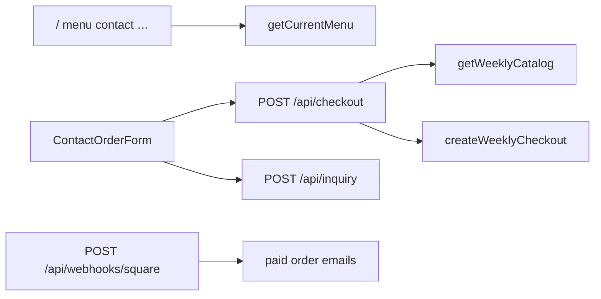

# Engineering log — completed work & customer-site review

Last updated: 2026-06-02

---

## Part 1 — Completed work (admin, security, tooling)

Work from the admin financials / security / quality pass. Build verified with `pnpm build` after a clean `.next`.

### Admin financials

| Item | Location / notes |
|------|------------------|
| Financials page + bake-week filter | `app/admin/(portal)/financials/page.tsx` |
| Stats engine (paid-only, exclude Refunded/Cancelled) | `lib/admin/financial-stats.ts`, `financial-stats-types.ts` |
| Multi-week payload (no refetch on week switch) | `buildFinancialDashboardPayload()`, `FinancialWeekDashboard` type |
| Charts (money flow, revenue trend, product mix, expenses) | `components/admin/financials/FinancialsVisuals.tsx` |
| Product Costs + Weekly Expenses sheet I/O | `lib/google-sheets/product-costs.ts`, `weekly-expenses.ts` |
| Admin APIs | `app/api/admin/financials/product-costs`, `expenses` |
| Seed script | `pnpm sheets:seed-financials` → `scripts/seed-sheets-financials.ts` |
| Week filter synced to URL | `?week=` + `AdminFinancialsView` |
| Partial load warnings | Financials page (amber alerts per failed tab) |
| Env-driven estimate footnotes | `lib/admin/financial-estimates.ts` |

### Customer order emails (admin)

| Item | Location |
|------|----------|
| Order detail + email UI | `app/admin/(portal)/orders/[internalRef]/page.tsx`, `AdminOrderCustomerEmail.tsx` |
| Send + history API | `app/api/admin/orders/customer-email/route.ts` |
| Templates + validation | `lib/email/customer-order-update.ts`, `lib/admin/send-customer-order-email.ts` |

### Admin auth & security

| Item | Location |
|------|----------|
| HMAC session cookies (3-day TTL) | `lib/admin/session-token.ts` |
| Password rules + timing-safe compare | `lib/admin/auth.ts` |
| Login rate limit | `lib/admin/login-rate-limit.ts` |
| Middleware guard for `/admin` + `/api/admin` | `middleware.ts` |
| Portal layout auth (DRY) | `lib/admin/require-admin-portal.ts` — per-page checks removed |
| Public API hardening (checkout URL allowlist, inquiry clamps) | `lib/security/*`, `app/api/checkout`, `inquiry` |
| Security doc | `docs/SECURITY.md` |
| Headers | `next.config.mjs`, `app/robots.ts` |

### Admin API validation (second pass)

| Item | Location |
|------|----------|
| Shared JSON body limits + parsers | `lib/admin/api-input.ts` (+ unit tests) |
| Wired into status, customer-email, financials APIs | `app/api/admin/**` |
| Product cost slug upsert (no duplicate rows) | `resolveProductCostSheetRow()` |

### Quality & DX

| Item | Command / file |
|------|----------------|
| TypeScript split (no `googleapis` in client stats) | `financial-stats-types.ts`, `financial-summary-display.ts` |
| `pnpm typecheck` | `package.json` |
| Unit tests (financials, api-input, auth, production, …) | `pnpm test:unit` (78 tests) |
| Playwright admin smoke | `tests/admin-portal.spec.ts`, `pnpm test:e2e:admin` |
| Portal loading skeleton | `app/admin/(portal)/loading.tsx` |
| Shared script env loader | `scripts/lib/load-env-local.ts` |
| Settings ops panel | `app/admin/(portal)/settings/page.tsx` |
| ENV doc updates | `docs/ENV.md` |

### Chart / UI fixes (financials)

- Dynamic Tailwind in chart data → **inline hex fills** (`MONEY_SEGMENT_FILL`) so segments render correctly.
- Week revenue bars: pixel heights instead of broken `%` in flex layout.

### Known admin follow-ups (not done)

- O(weeks) full recompute in `buildFinancialDashboardPayload` at large history scale.
- Authenticated Playwright flows (login + save costs).
- CI job wiring `typecheck` + `test:unit` + `test:e2e:admin`.
- Redis-backed global rate limits (documented in `docs/SECURITY.md`).

---

## Part 2 — Customer-facing site review (strict)

Scope: public routes, `components/{home,menu,order,contact,layout,ui,wildflower}`, customer `lib/` usage, `app/api/checkout`, `inquiry`, `webhooks/square`. Excludes admin and playbook.

### Architecture (what’s good)

- **Server-first pages** with small client islands (`contact`, cart, header nav).
- **Menu cached** via `getCurrentMenu()` → `unstable_cache` (300s, tag `weekly-menu`) in `lib/content/load-menu.ts`.
- **Prices authoritative on server** at checkout (`getWeeklyCatalog()`), not client totals.
- **Square webhook** HMAC + optional Redis idempotency.
- **Checkout redirect** allowlisted (`lib/security/safe-external-url.ts`).
- **Security headers** in `next.config.mjs`; `robots.ts` blocks admin paths.



---

### Critical

#### Public rate limits do not throttle successful abuse

`lib/security/rate-limit.ts`:

- `checkRateLimit()` never increments `count` on allowed requests.
- `recordRateLimitFailure()` only runs in **catch** blocks on checkout/inquiry.

So every **successful** inquiry email and checkout session is unlimited per IP. `docs/SECURITY.md` claims defense against inquiry spam — **implementation does not match**.

**Fix:** Add `recordRateLimitHit(key)` (increment on every attempt, success or failure) or merge check + increment in one call; call it at the start of each POST after passing validation (or at end of every handled request).

---

### High

#### Root layout forces dynamic rendering for the entire site

`app/layout.tsx` calls `headers().get("x-pathname")` to hide Header/Footer on admin. That opts **all** public marketing pages out of static/ISR.

**Fix:** Route groups: `(site)/layout.tsx` (static-friendly) vs `admin/layout.tsx` (no `headers()`), or accept admin chrome only via `AdminShell` without toggling root layout.

#### In-memory rate limits are per serverless instance

Documented in `docs/SECURITY.md`. Combined with the counting bug above, effective protection on Vercel is near zero at scale.

---

### Medium

| Issue | Detail | Paths |
|-------|--------|-------|
| **Ordering closed UX inconsistent** | Three message sources: `getOrderingPublicState`, `getOrderingClosedMessage`, `ClosedMenuCTA` / schedule | `lib/menu/ordering-gate.ts`, `ordering.ts`, `schedule.ts`, layout banner |
| **Homepage ignores closed state** | Hero copy always “open for preorder”; spotlight CTA always shown | `components/home/Hero.tsx`, `ThisWeekMenuSpotlight.tsx` |
| **`menuCycleId` from static fallback** | `weekly-fulfillment.ts` uses `currentMenu` from `lib/content/currentMenu.ts`, not live sheet menu | Square metadata can disagree with admin sheet |
| **`soldOut` never from Sheets** | Parser hardcodes `soldOut: false`; UI supports sold-out | `lib/content/menu-from-sheet.ts`, `ProductCard`, checkout does not reject sold-out slugs |
| **Per-item Square links not allowlisted** | `MenuOrderButton` renders any `https://` `squareCheckoutUrl` | `components/menu/MenuOrderButton.tsx` — checkout API is safe; legacy external links are not |
| **Launch flags vs routes** | `giftComfortBoxesEnabled: false` hides nav; `/gifts` and `?intent=gift` still reachable | `lib/content/launch.ts`, `app/gifts/page.tsx`, inquiry API |
| **Inquiry “success” when email skipped** | Resend unconfigured → `{ success: true }` to user | `lib/email/send.ts`, inquiry route |
| **Lib imports component types** | `form-copy.ts` imports `ContactIntent` from component | Should use `lib/contact/intents.ts` only |
| **FAQ entirely client page** | `app/faq/page.tsx` is `"use client"` | Could be server page + client `Accordion` only |

---

### Low — dead code & drift

#### Unused components (no imports from live pages)

| File |
|------|
| `components/home/TreatGrid.tsx` |
| `components/home/EmotionalSection.tsx` |
| `components/home/GiftSection.tsx` |
| `components/home/RecentBakes.tsx` |
| `components/home/RecentBakesGallery.tsx` |
| `components/home/FaqTeaser.tsx` |
| `components/home/WildFlowerFundSection.tsx` |
| `components/home/HeroFundTransition.tsx` (stub) |
| `components/menu/ProductGrid.tsx` |
| `components/ui/SectionWrapper.tsx` |

~**10 files** from an older homepage/menu design. Safe to delete after visual confirm.

#### Unused / redundant lib

| Item | Notes |
|------|-------|
| `lib/content/menu.ts` | Only re-exports + deprecated `weeklyMenu`; **zero TS imports** (README reference only) |
| `resolvePrefillSlug()` in `lib/contact/prefill.ts` | Never called |
| `getProductGridClassName()` | Only used by dead `ProductGrid` |
| `getWeeklyOrderingState()` in `schedule.ts` | Never imported |
| `getHomepageFaqEntries()`, `shouldShowTreatCategory()` | Only via dead homepage components |

#### Consistency nits

- `OrderingStrip` inlines button classes instead of `Button`.
- `ContactOrderForm` duplicates name/email/phone blocks across intents.
- `isMenuOpen()` vs `isWeeklyOrderingAccepted()` — two entry points (same behavior today).
- No `app/sitemap.ts`.
- Webhook `GET` returns `{ ok: true, endpoint: "square-webhook" }` (minor info leak).

---

### Public routes reference

| Route | Rendering | Main deps |
|-------|-----------|-----------|
| `/` | Server | `getCurrentMenu`, home sections |
| `/menu` | Server + metadata | `getCurrentMenu`, `isMenuOpen` |
| `/contact` | Server + client form | catalog, ordering gate, prefill |
| `/about`, `/gifts`, `/little-extras`, `/wild-flower-fund` | Mostly static content | `lib/content/*` |
| `/faq` | Client page | `lib/content/faq` |
| `/order/success` | Static | post-Square |
| `/playbook` | Separate (public, no auth) | not in customer UX review scope |

---

### Priority fix list (customer site)

1. **CRITICAL** — Fix rate limiter counting for checkout + inquiry.
2. **HIGH** — Split layouts to drop `headers()` from public root (restore static where possible).
3. **MEDIUM** — Single ordering-closed message; gate homepage Hero/spotlight on `isWeeklyOrderingAccepted()`.
4. **MEDIUM** — Pass live `menuCycleId` from `getCurrentMenu()` into checkout/Square metadata.
5. **MEDIUM** — Wire `soldOut` from sheet (or remove UI); enforce at checkout.
6. **MEDIUM** — Allowlist `squareCheckoutUrl` in `MenuOrderButton` (same as checkout API).
7. **LOW** — Delete dead components + `lib/content/menu.ts`; fix `form-copy` import; FAQ server split; add `sitemap.ts`.

---

### Verification commands

```bash
pnpm typecheck
pnpm test:unit
pnpm test:e2e:admin
pnpm build
```

---

## Part 3 — Full application review

See **[FULL_APPLICATION_REVIEW.md](./FULL_APPLICATION_REVIEW.md)** for the continued pass: order pipeline (Square/webhook/store), Sheets layer, email semantics, admin status mismatch, cross-cutting security, dead code inventory, testing/CI gaps, and P0–P3 priority matrix.

## Part 4 — What this doc does *not* cover

- **Production deploy / Vercel env** — see `docs/ENV.md`.
- **Uncommitted git state** — commit when ready.
