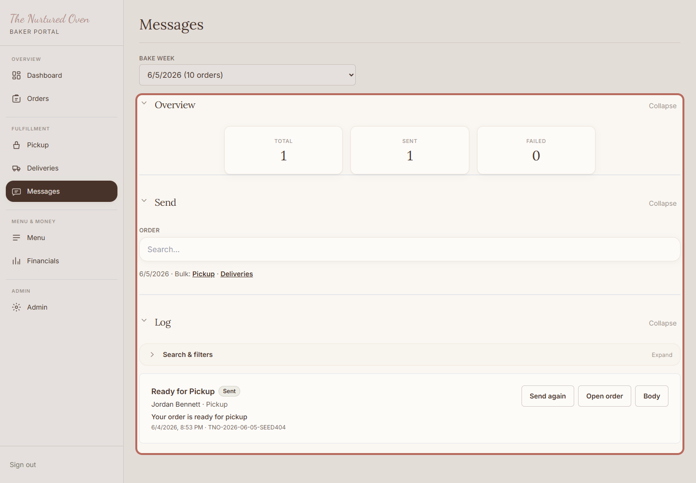
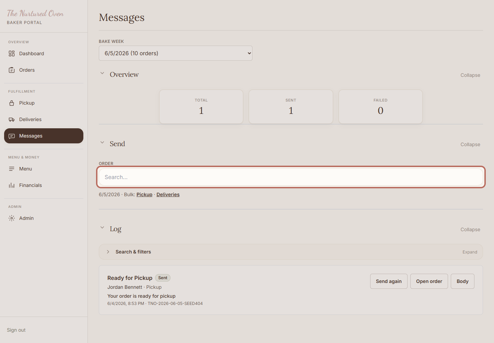
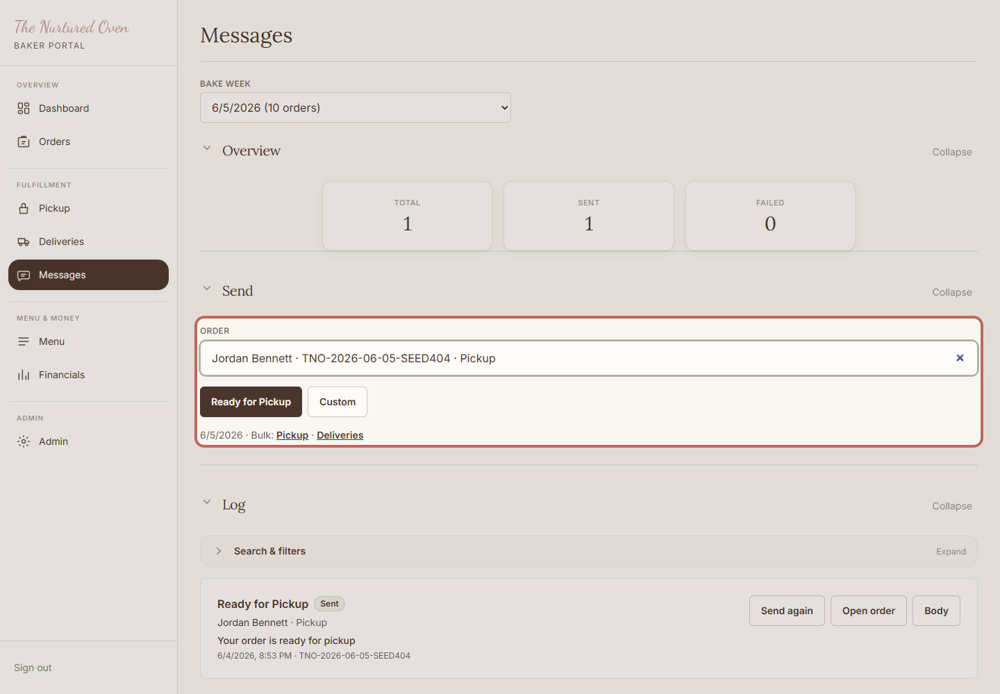
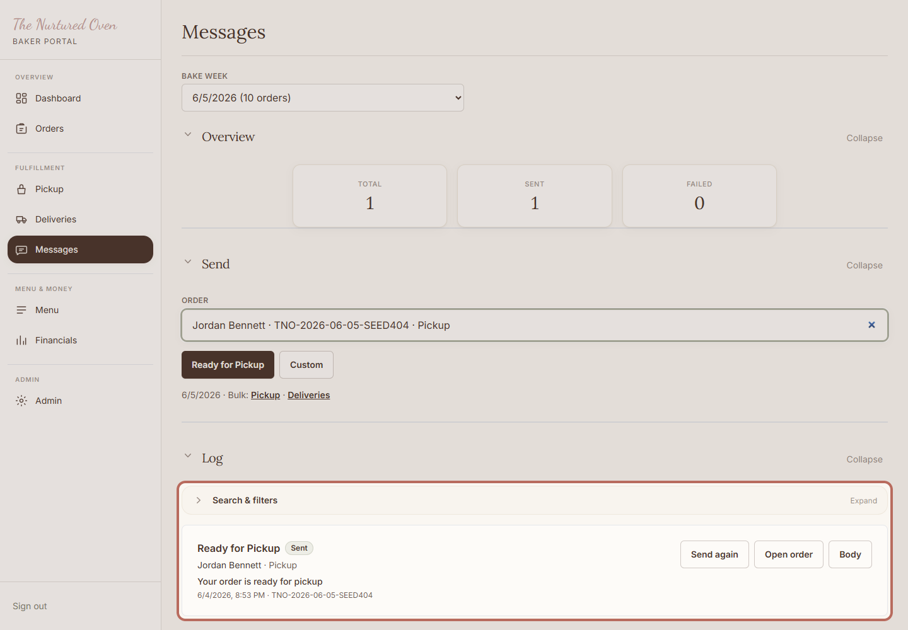

# SOP: How to send customer updates

## Purpose

Use this to send short, helpful updates when an order is ready, out for delivery, or needs a personal note.

## When to use this

- When a pickup order is ready.
- When delivery orders are heading out.
- When one customer needs a clear update.

## Before you start

- You can log in to the admin area.
- The order is paid and has a customer email.
- You know what the customer needs to hear.

## Steps

### 1. Open Messages

Open Messages in the admin area. This is where customer notes can be sent and reviewed.

Expected result:
You can see the message overview, send area, and log.

### 2. Choose the order

Search for the customer or order, then choose the right one before writing or sending.

Expected result:
The correct order is selected.

### 3. Choose the update type

Choose the update type that matches the situation.

The app will show a preview before you send. Keep any custom note short and kind.

Expected result:
You can see the update choices for the selected order.

### 4. Check the message log

Check the log after sending so you know what has already gone out.

Expected result:
You can see recent customer updates.

## Success check

- The right customer was selected.
- The message is short and clear.
- The log shows what was sent.

## Common mistakes

- Choosing the wrong customer.
- Sending a message before the order is actually ready.
- Writing too much when a short note would be clearer.

## If something goes wrong

If the order does not appear, check that it has a customer email. If you are unsure what to say, pause and ask Chandler.

## Need help?

Ask Chandler before sending a message that feels confusing or sensitive.
