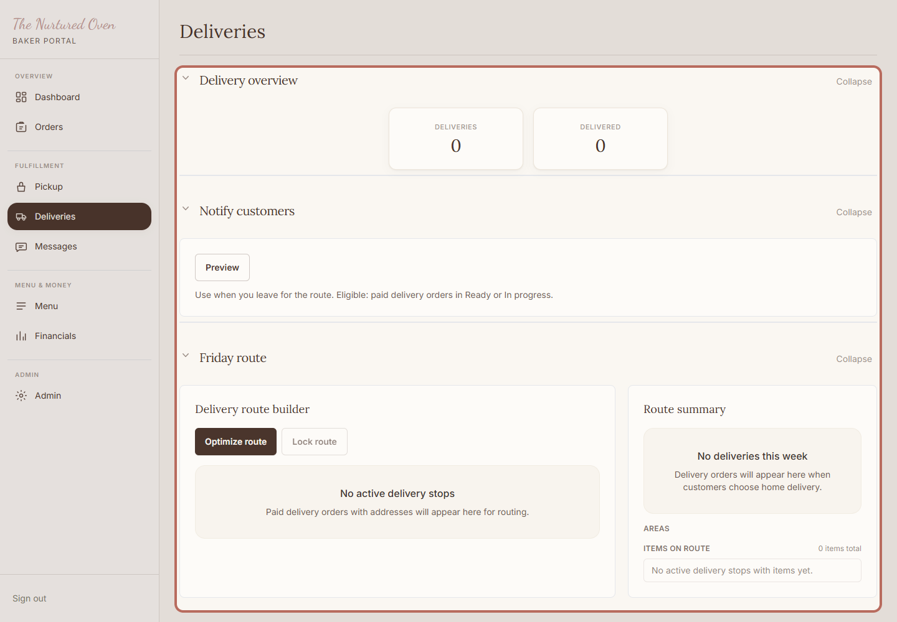
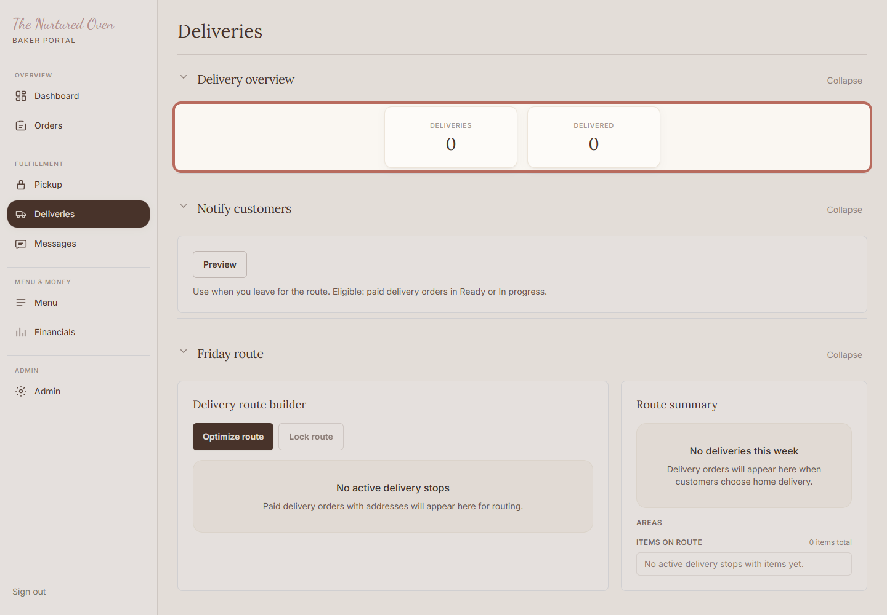
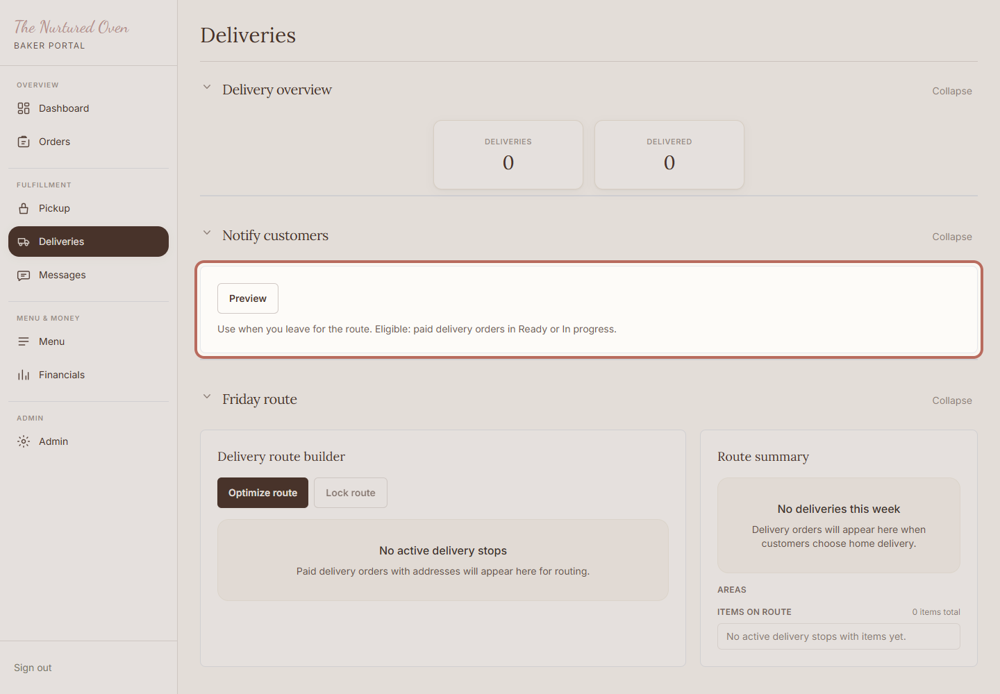
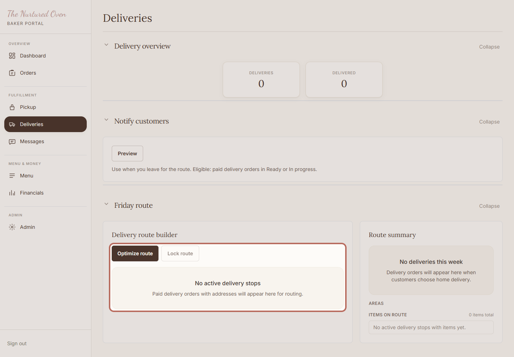
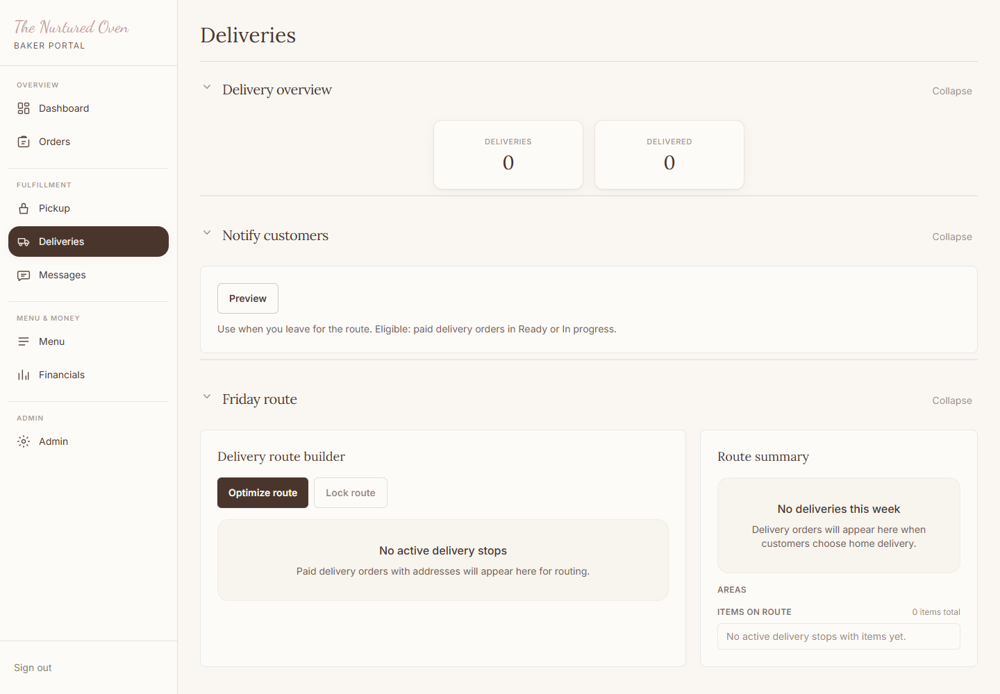

# SOP: How to manage delivery orders

## Purpose

Use this to review delivery orders, check addresses, plan the delivery path, and mark deliveries complete.

## When to use this

- Before leaving for deliveries.
- When checking addresses and customer notes.
- After each delivery is complete.

## Before you start

- You can log in to the admin area.
- Delivery orders are visible for the week.
- Orders are packed before you leave.

## Steps

### 1. Open Deliveries

Open Deliveries in the admin area. This is the working list for the delivery path.

Expected result:
You can see the delivery overview and delivery plan.

### 2. Check the overview

Check the overview so you know how many deliveries are still active.

Expected result:
You know how many delivery orders need attention.

### 3. Send delivery notes if used

Use Notify customers when delivery orders are ready and customers should know you are heading out.

Expected result:
Customers can be told their orders are on the way.

### 4. Plan the delivery path

Use the delivery plan to check stops, addresses, and the map link before leaving.

Expected result:
The delivery stops are clear before you leave.

### 5. Mark delivered

Click Mark delivered after the order has been dropped off.

If no delivery orders are active, you may only see the empty delivery list. That is okay.

Expected result:
The order moves out of the active delivery list, or the active list is already clear.

## Success check

- Addresses are checked before leaving.
- Any missing address is handled before delivery.
- Delivered orders are marked only after drop-off.

## Common mistakes

- Leaving before checking for missing addresses.
- Marking delivered before the order is dropped off.
- Forgetting to check the customer phone number when there is an issue.

## If something goes wrong

If an address is missing, contact the customer before leaving. If the delivery path feels confusing, pause and ask for help before driving.

## Need help?

Ask Chandler before marking a delivery complete if anything is unclear.
