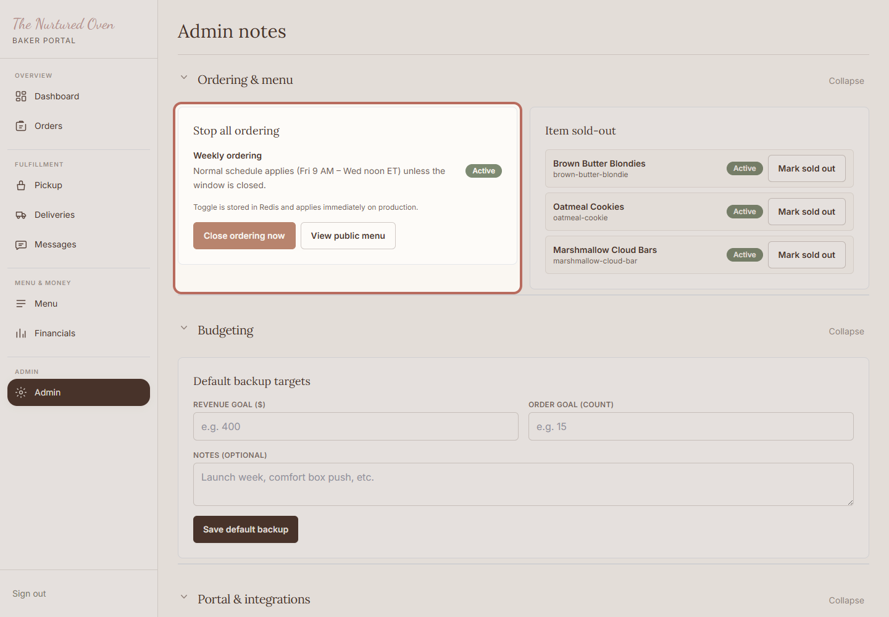
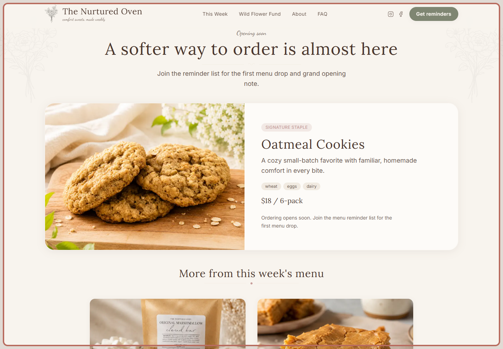

# SOP: How to open or close ordering

## Purpose

Use this when you want customers to start ordering, or when you need to pause new orders.

Closing ordering is safe. It gives you time to check the menu before more orders come in.

## When to use this

- Before opening orders for a new week.
- When the menu is still being checked.
- When you are sold out, overwhelmed, or unsure.

## Before you start

- You can log in to the admin area.
- The weekly menu has been checked.
- You know whether customers should be able to order right now.

## Steps

### 1. Open Admin notes and check ordering

Open Admin notes. This is where the ordering safety controls live.

Check the status before changing anything. This controls what customers can do next.

Expected result:
You know whether customers can order right now.

### 2. Open or close ordering

Click the ordering button only when you are ready. If you are unsure, closing ordering is the safest choice.

Expected result:
The status changes so customers can order, or cannot order, as needed.

### 3. Check the public menu

Open the public menu and check what customers see after the change.

Expected result:
The public menu matches the ordering choice you made.

## Success check

- The ordering status matches what you want right now.
- The public menu looks correct.
- Ordering is closed if anything still feels uncertain.

## Common mistakes

- Opening ordering before checking the public menu.
- Forgetting to close ordering when the menu is still changing.
- Marking one item sold out when the whole week should be paused.

## If something goes wrong

Close ordering first. Then check the menu and paid orders. Ask Chandler for help if the next step is not clear.

## Need help?

Ask Chandler. You can keep ordering closed while you check.
