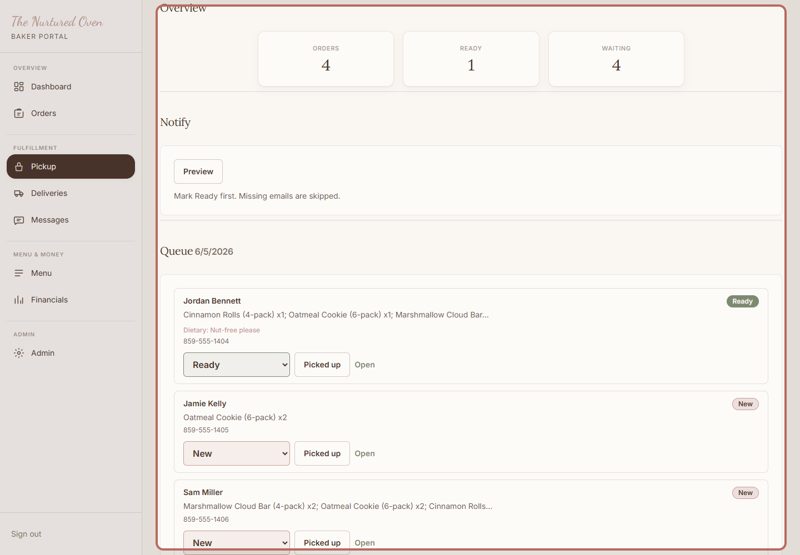
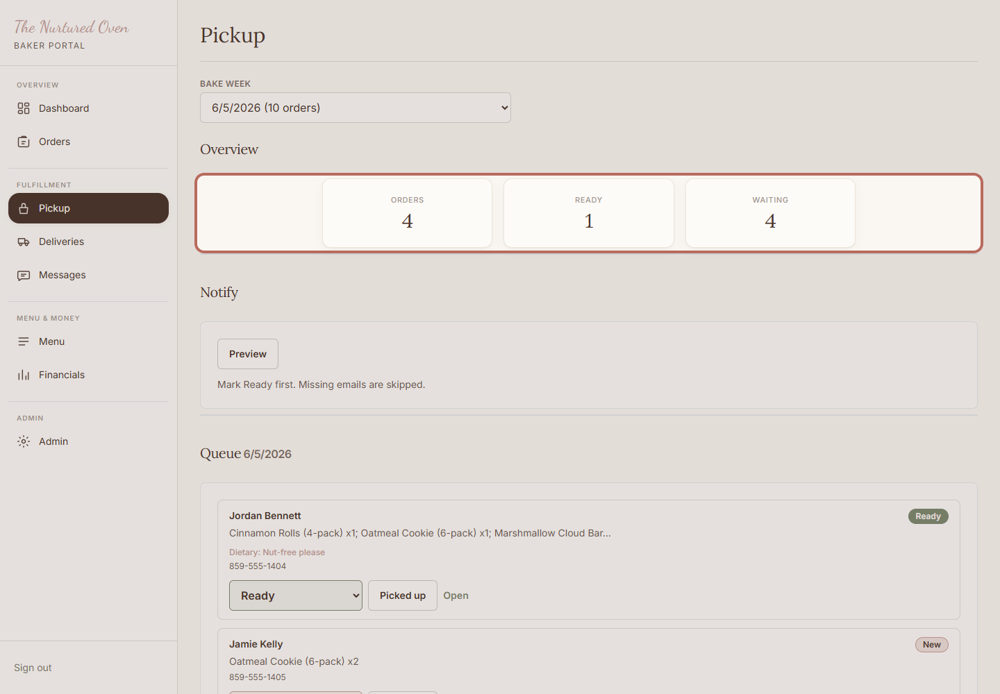
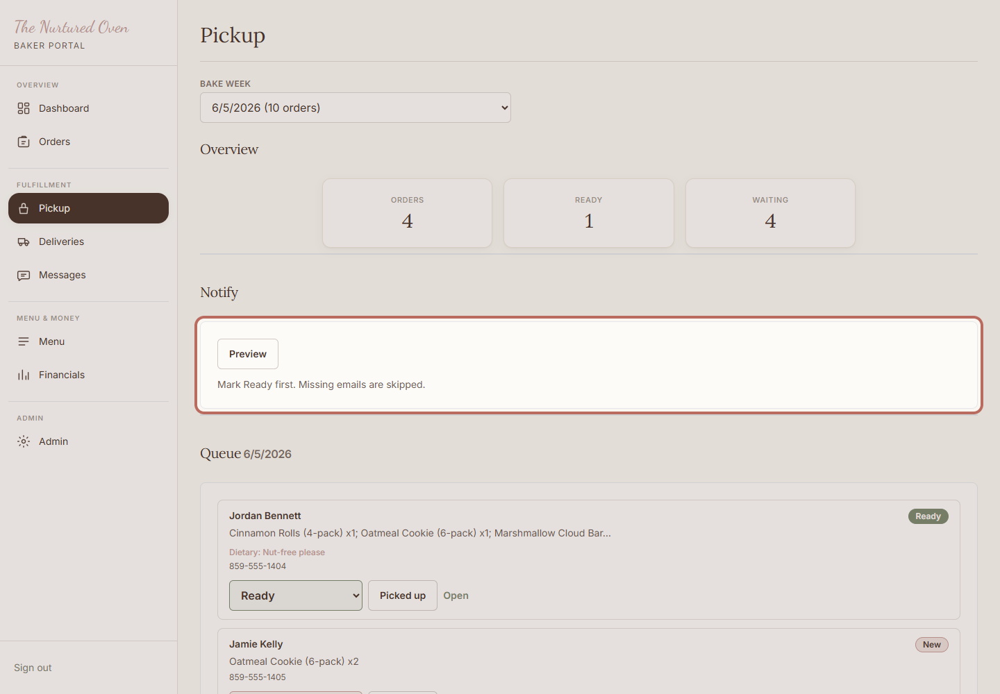
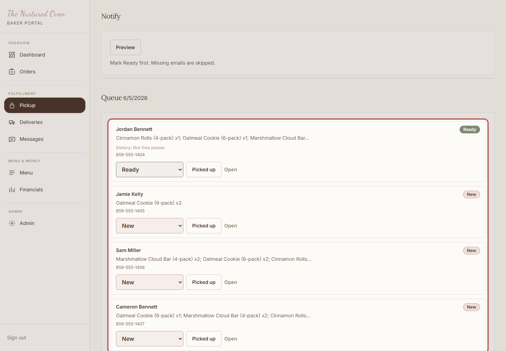
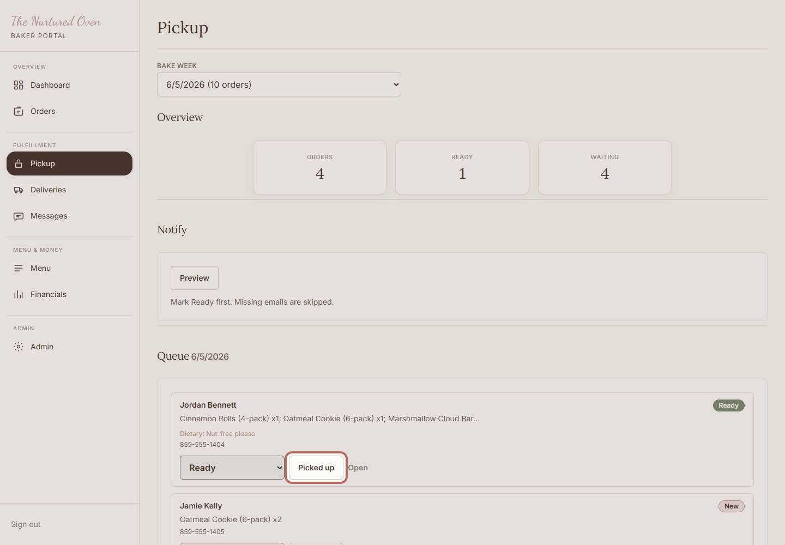

# SOP: How to manage pickup orders

## Purpose

Use this on pickup day to keep pickup orders organized and mark them complete after customers collect them.

## When to use this

- On pickup day.
- When orders are packed and ready.
- When a customer arrives for pickup.

## Before you start

- You can log in to the admin area.
- Pickup orders are visible for the week.
- Packed orders are ready to check against the pickup list.

## Steps

### 1. Open Pickup

Open Pickup in the admin area. This is the working list for customer pickups.

Expected result:
You can see the pickup overview and queue.

### 2. Review the overview

Check the overview so you know how many pickup orders are waiting or ready.

Expected result:
You know how many pickup orders need attention.

### 3. Send pickup notes if used

Use Notify when pickup orders are marked Ready and customers should know they can come by.

Expected result:
Customers with ready pickup orders can be notified.

### 4. Work through the queue

Use the queue to check each customer's items, notes, and status.

Expected result:
Each pickup order is easy to check before handing it off.

### 5. Mark picked up

Click Picked up after the customer has their order.

Expected result:
The order moves out of the active pickup queue.

## Success check

- Ready pickup orders are clear.
- Picked up orders are marked after customers collect them.
- Any confusing order is left unchanged until you can check it.

## Common mistakes

- Marking an order picked up before the customer receives it.
- Sending pickup notes before orders are actually ready.
- Missing a dietary note or customer message.

## If something goes wrong

If a customer arrives early, check the queue before handing off. If an order is missing, do not mark it picked up.

## Need help?

Open the order details or ask Chandler before changing anything that feels unclear.
