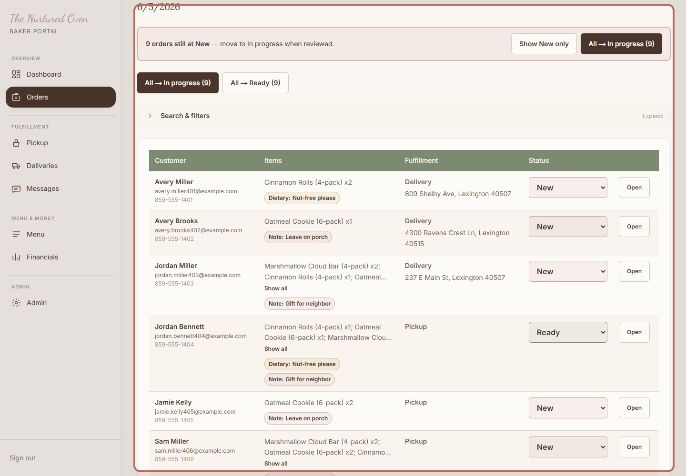
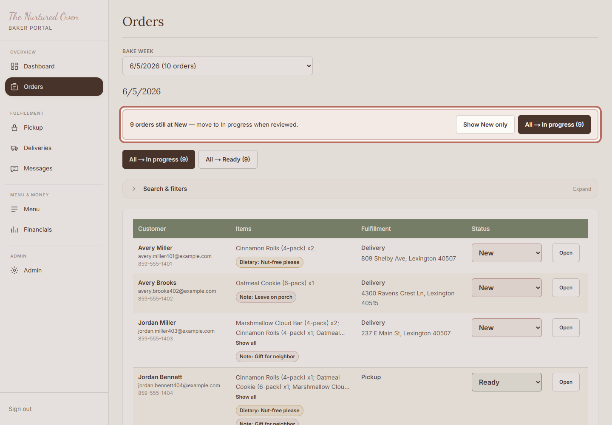
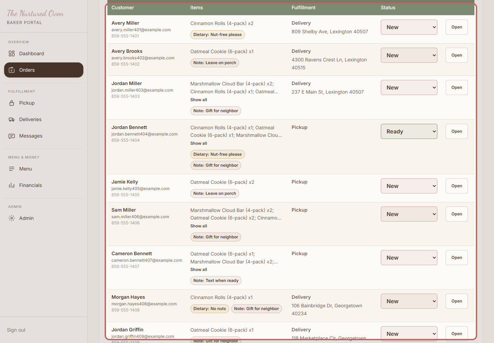
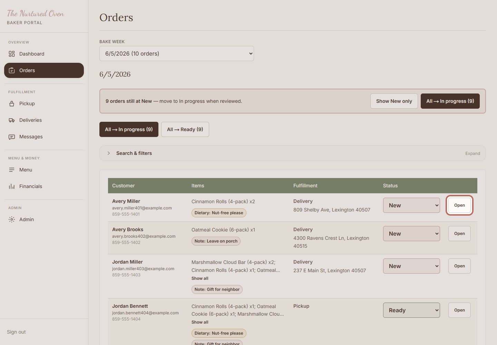

# SOP: How to review paid orders

## Purpose

Use this to see what customers have already paid for before baking, packing, pickup, or delivery.

## When to use this

- While ordering is open.
- Before prep day.
- Before bake day.
- Any time you need to check customer notes or order status.

## Before you start

- You can log in to the admin area.
- Orders have come in through the website.
- You have time to read names, items, and notes carefully.

## Steps

### 1. Open Orders

Open Orders in the admin area. This is where paid website orders are reviewed.

Expected result:
You can see this week's order list.

### 2. Check new orders

Check any New orders first. These are the orders that still need your first review.

Expected result:
You know which orders still need attention.

### 3. Review the list

Check the customer name, items, pickup or delivery choice, and status.

Expected result:
The orders look ready to use for baking and planning.

### 4. Open an order if needed

Click Open when you need more detail for one customer.

Expected result:
You can review the full order before making changes.

## Success check

- New orders have been reviewed.
- Customer notes are easy to find.
- Pickup and delivery choices are clear.
- You know what needs to be baked and packed.

## Common mistakes

- Changing a status too quickly before reading the order.
- Missing a customer note.
- Forgetting to check pickup and delivery choices.

## If something goes wrong

If an order looks confusing, leave it alone and ask for help. If too many orders are coming in, close ordering before reviewing more.

## Need help?

Ask Chandler before changing a paid order that does not make sense.
