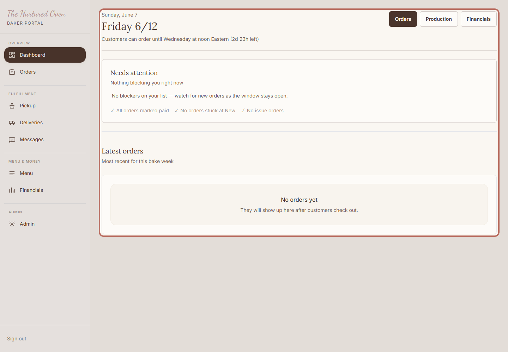
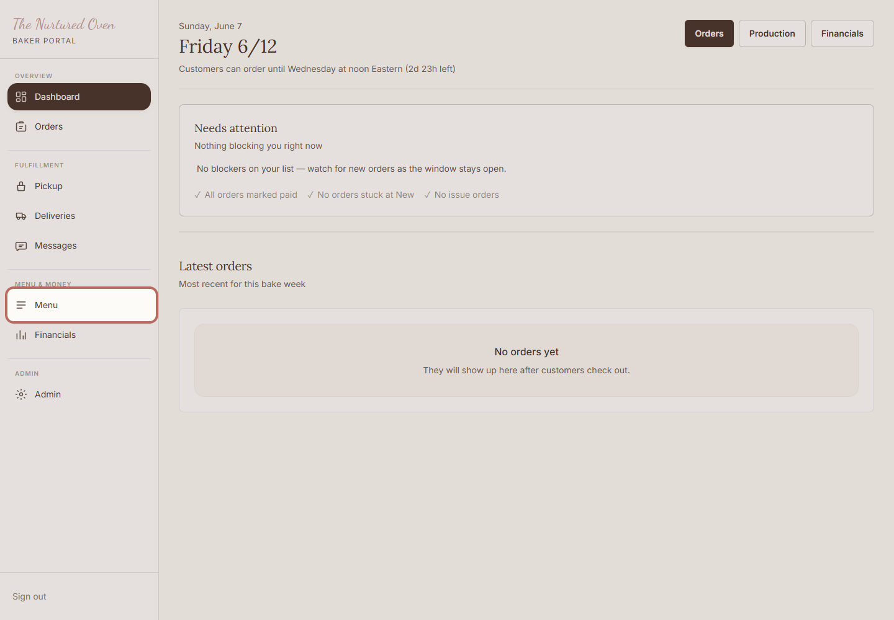
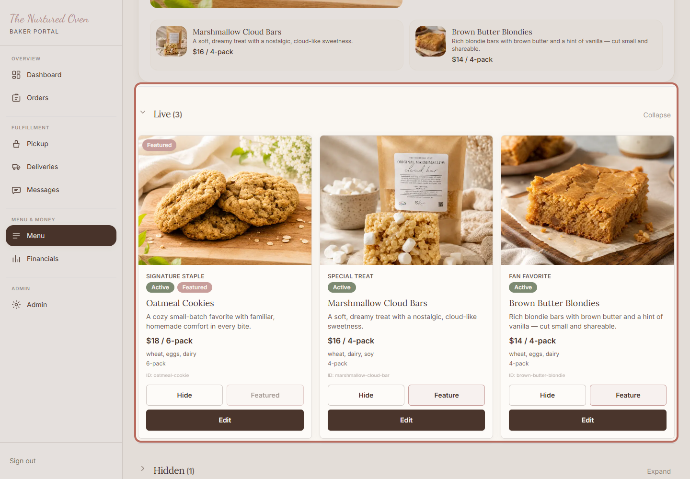
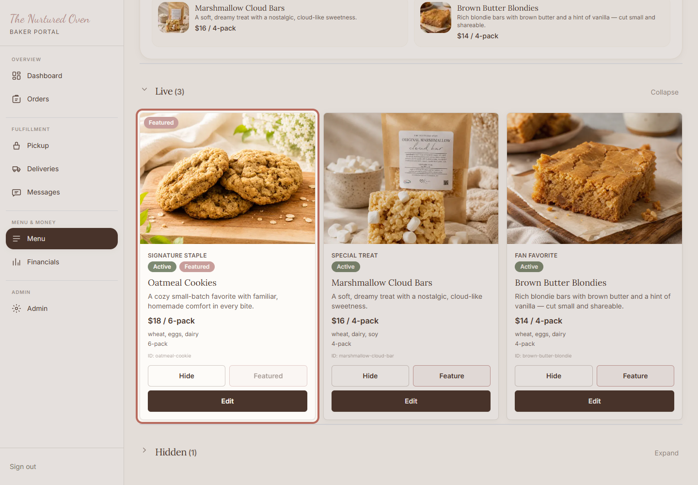
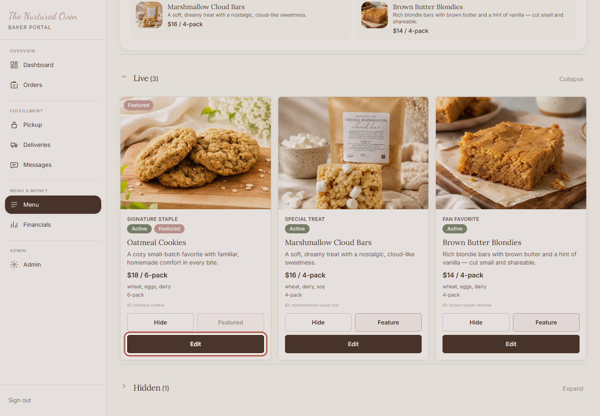
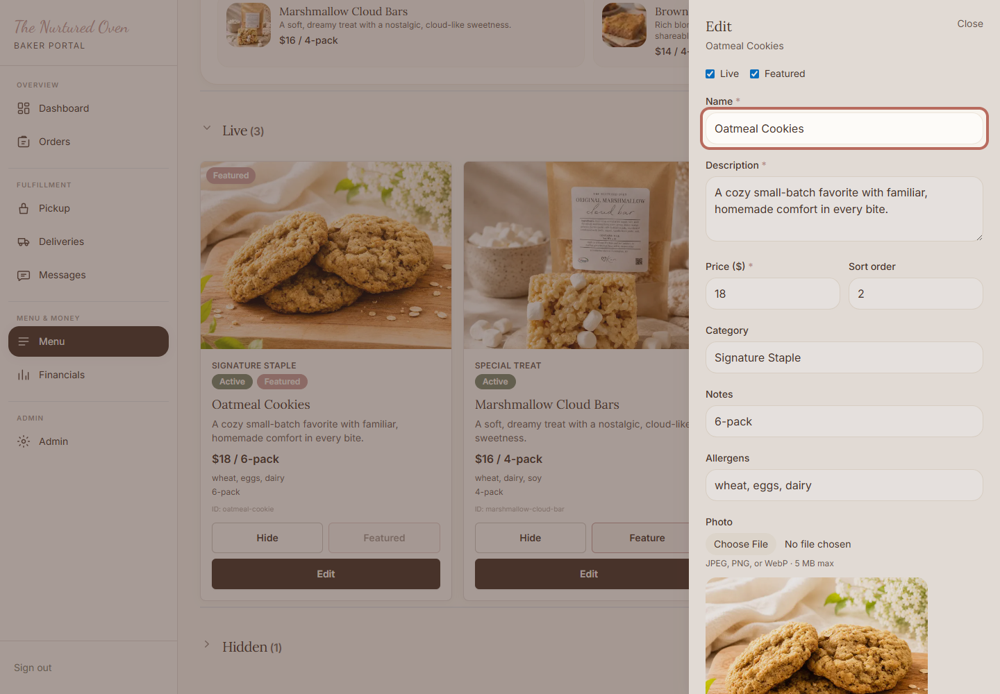
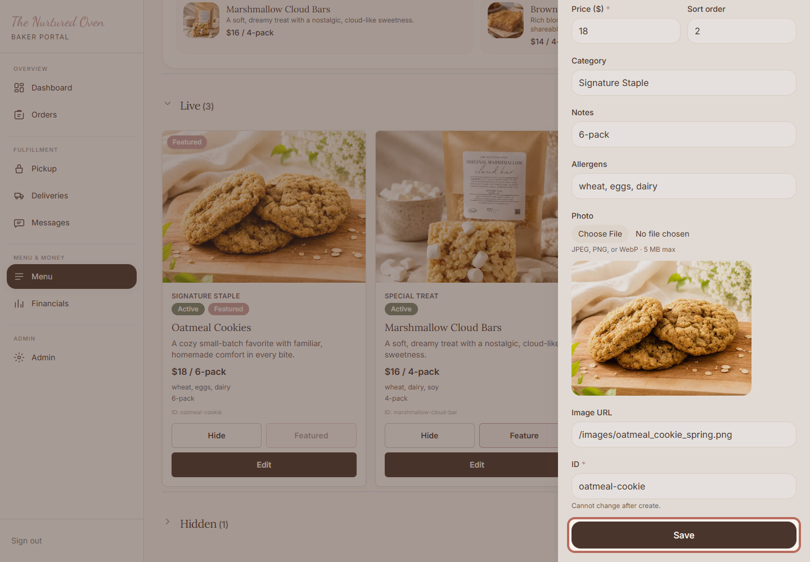
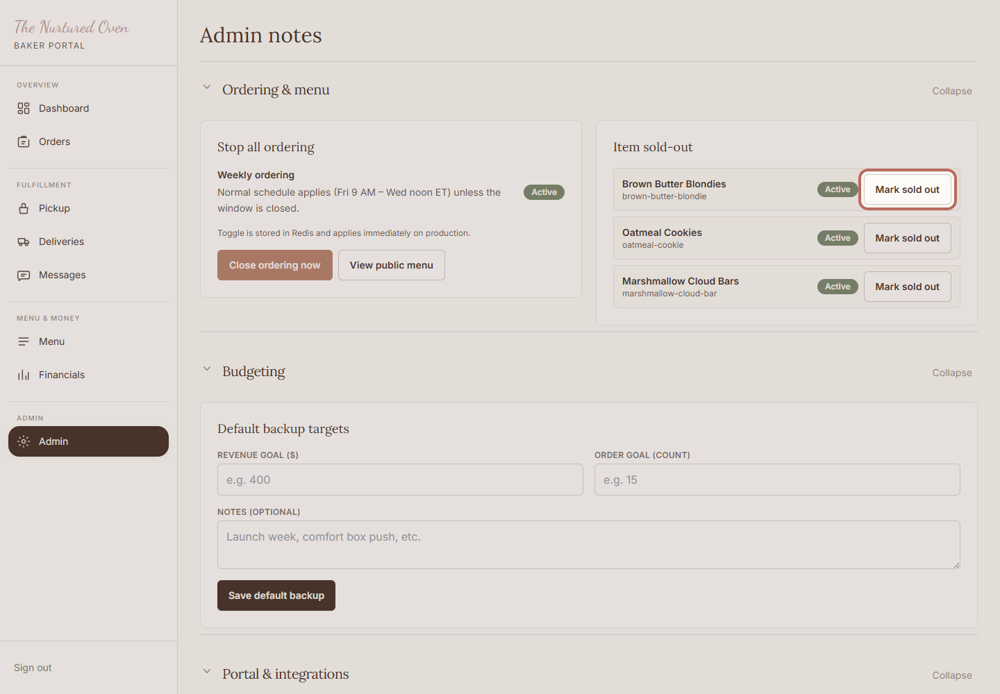
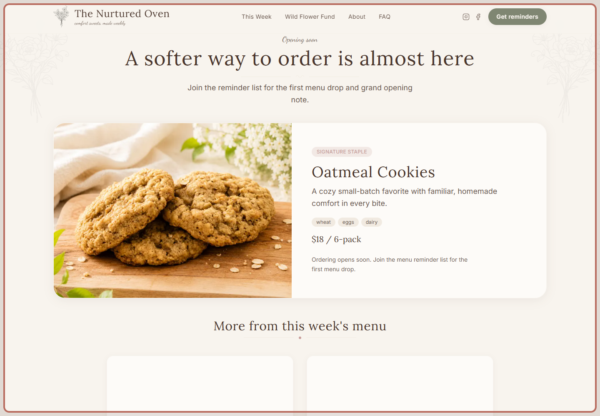
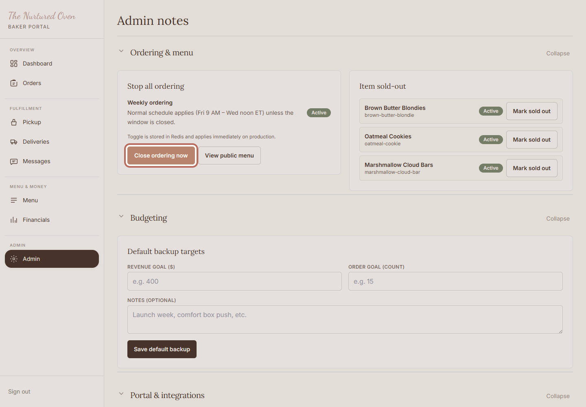

# SOP: How to update this week's menu

## Purpose

Use this guide when you need to update the bakes customers can see and order for the current week.

The goal is simple: make the menu match what you want customers to see.

## When to use this

Use this when:

* The weekly bake lineup changes.
* A menu item needs a new name, description, price, photo, or display setting.
* You are getting ready for a new weekly drop.

## Before you start

Have these ready:

* Your admin login.
* The new menu details.
* Any new item photo saved on your computer.

If you are not sure the menu is ready, you can turn ordering off before customers order.

## Steps

### 1. Open the admin area

Open the admin area. Start here when you want to make changes to the bakery website.

Expected result:
You can see the baker portal.

### 2. Go to Menu

Click Menu in the admin area. This is where you control what customers can see and order this week.

Expected result:
The Menu page opens.

### 3. Review the menu page

Check the Live section first. These are the items customers can see on the website.

Expected result:
You can see the current live menu items.

### 4. Find the item

Find the item you want to update. If you do not see it, check the Hidden section or use Search.

Expected result:
The item you want to change is visible.

### 5. Open the item editor

Click Edit on the item. This opens the place where you can update the details.

Expected result:
The item editor opens from the side of the screen.

### 6. Update the main details

Update the name, description, price, and any helpful notes. Keep the wording short and clear for customers.

While you are here, check the live setting, featured setting, and photo before saving.

Expected result:
The item details match what customers should see.

### 7. Choose what is live or featured

Check Live if customers should see this item.

Check Featured if this should be the main item on the home page.

Expected result:
The item is set to show or hide the way you want.

### 8. Update the photo if needed

Add a new photo if this item needs one. A clear photo helps customers know what they are ordering.

Expected result:
The preview shows the photo you want customers to see.

### 9. Save the item

Click Save. Wait for the editor to close before moving on.

Expected result:
The Menu page shows the updated item.

### 10. Mark sold out if needed

If an item is still visible but cannot be ordered, open Admin and mark that item sold out.

Expected result:
The item stays visible, but customers can see it is sold out.

### 11. Check the public menu

Open the public menu when you are done. Check that the item looks right for customers.

Expected result:
The public menu matches what you saved.

### 12. Pause ordering if you are unsure

If something looks wrong and customers should not order yet, open Admin and click Close ordering now.

Expected result:
Customers cannot place new orders while you fix the menu.

## Success check

You are done when:

* The public menu shows the correct items.
* The featured item is the one you want to highlight.
* Prices, descriptions, and photos look right.
* Ordering is closed if you are unsure or still making changes.

## Common mistakes

* Forgetting to click Save after editing an item.
* Leaving an old item Live when it should be Hidden.
* Featuring the wrong item.
* Forgetting to check the public menu after saving.

## If something goes wrong

Stay calm. You have a safe option.

If the public page looks wrong, go back to Menu and check the item again.

If an item should not be ordered, mark it sold out or hide it.

If you are unsure, close ordering before customers order.

If saving does not work, stop and ask Chandler for help.

## Need help?

If anything feels off, pause ordering first. Then send Chandler a note with what you were trying to change and what you saw on the screen.
